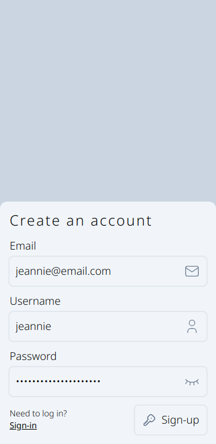
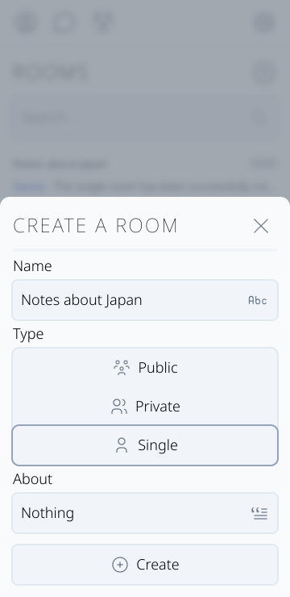

## Telescope Messenger Client

This is a web client for exchanging messages within rooms that are created and managed by users.  
If you need a server, then go [here](https://github.com/r7s9p9/telescope-server).

## Stack

- React
- React Router
- Typescript
- Zod
- TailwindCSS
- Vite
- Vitest
- Docker & Docker Compose

## Get Started

To get the telescope client running locally:

1. Clone this repo.
2. Move inside the project directory.
3. Create your own `.env` file. (There is `.env.example` in the project root)

- Dev  
  4. `npm install`  
  5. `npm run dev`

- Prod  
  4. `npm run docker:build`  
  5. `npm run docker:up`

## Features

- Rooms. There are public, private, single and service rooms. Users can create any type of room, except service rooms.

- Messages. Users can write, edit and delete their messages in rooms in which they are members. Public room messages can be read by any user without joining, except for banned ones.

- Account. To use the main part of the application's functionality, the user needs to create an account and log into it. A logged-in user can change their profile information, such as username, name, bio, and also set privacy settings that are visible only to them, but affect the behavior of activities associated with their account.

- Sessions. Logged-in users can view a list of active sessions and remotely log out of any device. If the user already has at least one active session and tries to log into his account from another device, he will receive a confirmation code from the service room inside the application. A kind of two-step authentication.

- Search. Users can only find public rooms or rooms in which they are already members. Rooms in which a specific user has been banned will not be displayed and that user will not have any access to them. To join private rooms, the user must receive an invitation from the creator of the room.

## Screenshots

|  | 
| ------------------------------------------------- | ------------------------------------------------------ |
|  |  |
|  |  |
|  |  |
|  |  |
|  |  |
